# Lunch_Ticket_Vin

First Repo on On boarding day at VSF

## Documentation

Student lunch card management system — see [`CLAUDE.md`](CLAUDE.md) for the project brief and non-negotiable design principles. Progress below is tracked against the mentor's 7-item checklist. This is a design/documentation pipeline, each item builds on the previous one.

### 1. Requirements (INVEST)

- [`problem-statement.md`](docs/investment/problem-statement.md) — scope, pain points (priority order), depth areas, out-of-scope
- [`usecase.md`](docs/investment/usecase.md) — use case diagram (28 use cases, 4 actors), Mermaid + traceability table
- [`requirements.md`](docs/investment/requirements.md) — one INVEST user story per use case, grouped by depth; open `[TBD]` business rules listed at the bottom

Full detail / rationale: [`usecase.md`](docs/investment/usecase.md)

### 2. Screen design (Information Architecture → Screens Hierarchy → UI/UX)

- [`ia-screens.md`](docs/screens_hierarchy/ia-screens.md) — information architecture and screens hierarchy for all 4 actors (Student, Counter Staff, Kitchen, Admin), each screen cross-referenced to a use case

Student flow (the other 3 actors — Counter Staff, Kitchen, Admin — have their own diagrams in the full file):

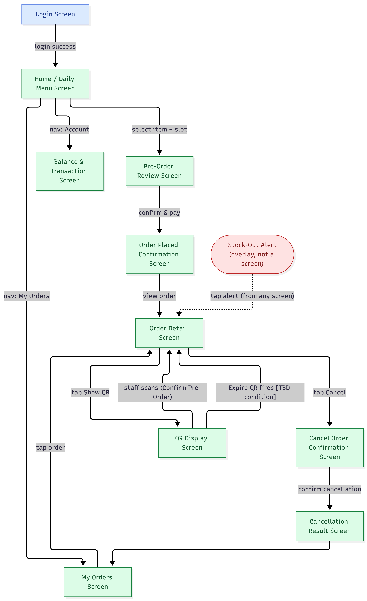

Full detail / rationale: [`ia-screens.md`](docs/screens_hierarchy/ia-screens.md)

Wireframes (HTML, click-through): [`docs/wireframes/`](docs/wireframes/README.md) — 18 screens across Student (10) and Staff & Kitchen (8), built with a shared token set ([`docs/design-system.md`](docs/design-system.md)) and a repeatable `/design-screen` command so future screens stay consistent.

**Screenshots — Student app:**

<table>
<tr>
<td width="33%">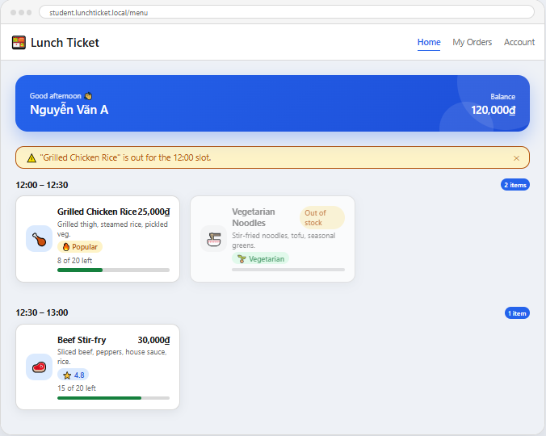 Home / Daily Menu</td>
<td width="33%">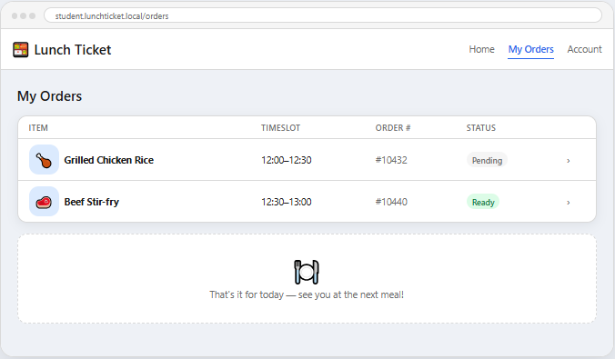 My Orders</td>
<td width="33%">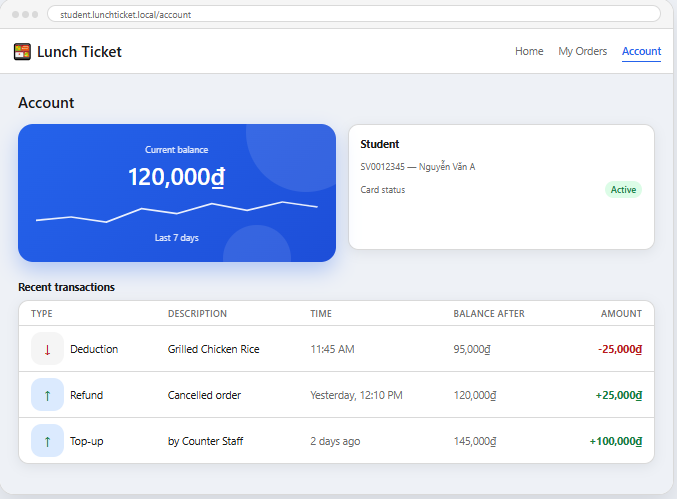 Balance & Transaction</td>
</tr>
</table>

**Screenshots — Staff & Kitchen app:**

<table>
<tr>
<td width="33%">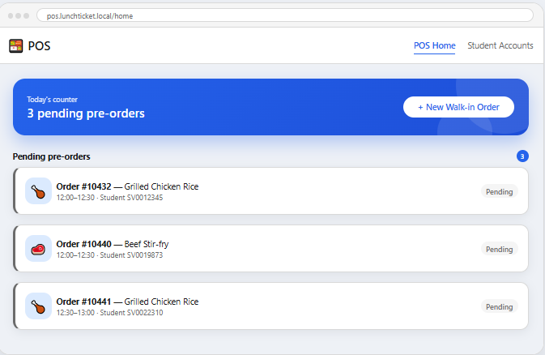 POS Home</td>
<td width="33%">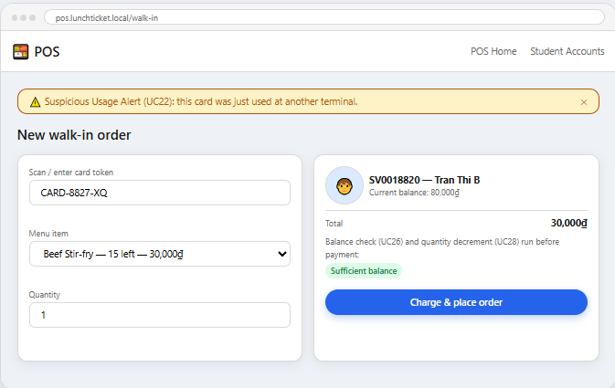 Create Walk-in Order</td>
<td width="33%">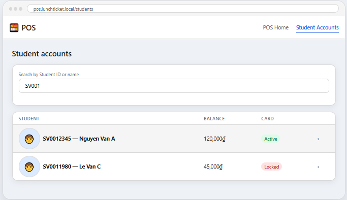 Student Accounts</td>
</tr>
</table>

Full click-through set (all 18 wireframes): [`docs/wireframes/README.md`](docs/wireframes/README.md)

> **Status:** IA/Screens Hierarchy done. Wireframes (HTML) — Student + Staff & Kitchen done, Admin not started. Hi-fi visual design — not started yet.

### 3. C4 model (Context, Container, Components)

- [`c4/context.md`](docs/architecture/c4/context.md) — Level 1, system context (actors ↔ system)
- [`c4/container.md`](docs/architecture/c4/container.md) — Level 2, containers (3 frontend apps, backend API, database)
- [`c4/component.md`](docs/architecture/c4/component.md) — Level 3, backend components: Order, Ledger, Card & Fraud, Menu, Notification services

**Context (Level 1):**

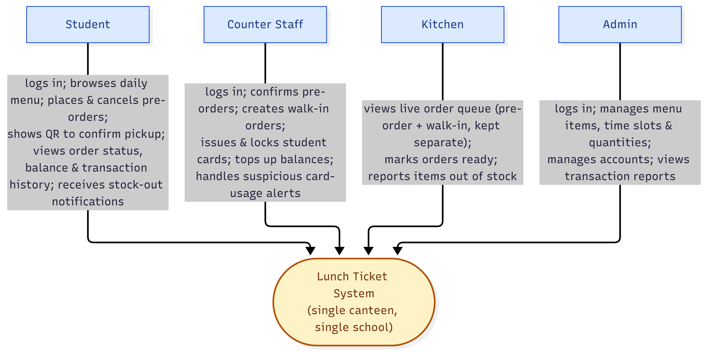

**Container (Level 2):**

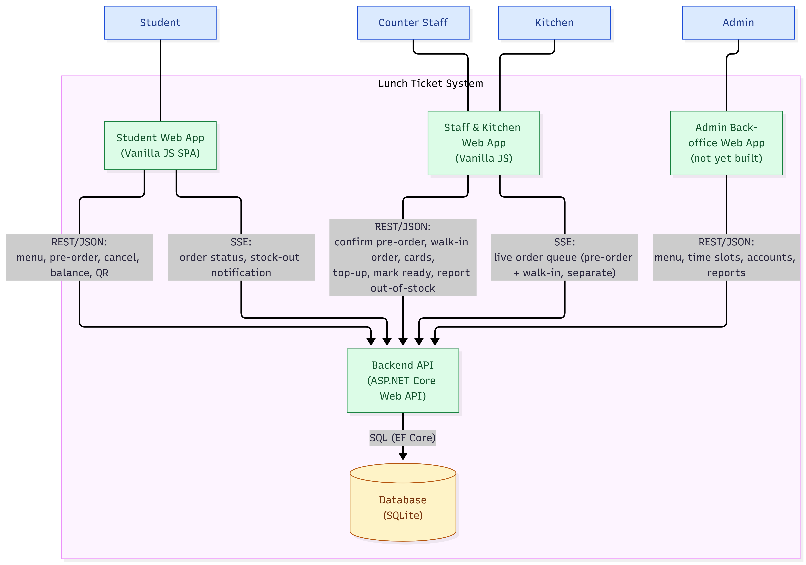

**Component (Level 3):**
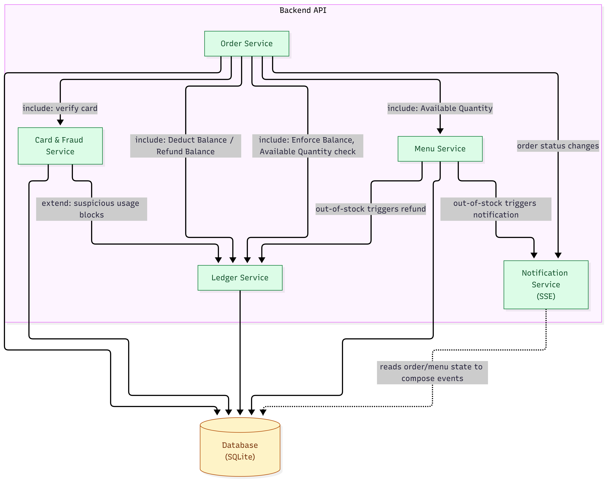

Full detail / rationale: [`c4/context.md`](docs/architecture/c4/context.md), [`c4/container.md`](docs/architecture/c4/container.md)

### 4. Database diagrams + API docs (OpenAPI 3.0 / Swagger)

- [`erd.md`](docs/api/erd.md) — Mermaid ERD + FK/use-case traceability table
- [`schema.dbml`](docs/api/schema.dbml) — DBML schema (paste into dbdiagram.io), matches `lunchcard.db`
- [`openapi.yaml`](docs/api/openapi.yaml) — OpenAPI 3.0 working skeleton, matched against `lunchcard.db`'s live schema

Full detail / rationale: [`erd.md`](docs/api/erd.md)

### 5. Folder structure — Frontend (ReactJS) + Backend (3-tier)

- [`structure/backend.md`](docs/structure/backend.md) — ASP.NET Core Web API 3-tier layout (Controllers → Services → Repositories → Models/DTOs), `LunchTicket.Api` namespace
- [`structure/frontend.md`](docs/structure/frontend.md) — target ReactJS structure, 3 apps (Student, Staff & Kitchen, Admin) mirroring the C4 containers

### 6. Class diagrams + Sequence diagrams (based on #5, #4, #3)

- [`sequence-diagram-guide.md`](docs/architecture/sequence-diagram-guide.md) — self-guided method + one worked example (UC1 Login); remaining use cases (UC6, UC7, UC8, UC9, UC19, etc.) are scaffolded with participants pre-picked but not yet drawn

Worked example — UC1 Login:

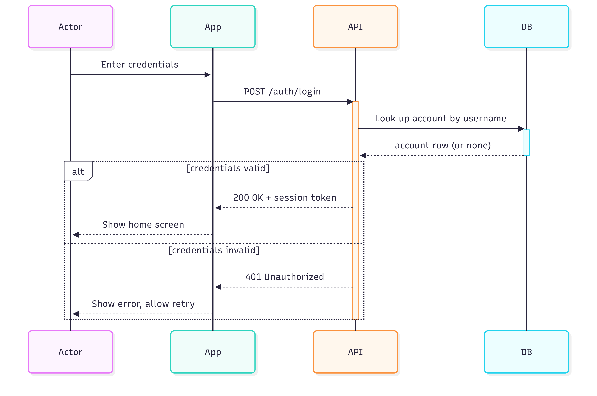

Full detail / rationale: [`sequence-diagram-guide.md`](docs/architecture/sequence-diagram-guide.md)

> **Status:** Sequence diagrams — method + one worked example (UC1 Login) done, remaining use cases not yet drawn. Class diagrams — not started yet.

### 7. API code + unit tests

> **Status:** Not started yet.

### Known gaps (tracked, not hidden)

- Admin frontend not designed yet (deferred).
- Open `[TBD]` business rules: pre-order cancellation refund cutoff/%, fraud-detection thresholds, QR expiry rule.
- Two flagged use-case-diagram inconsistencies (see `docs/investment/requirements.md`): Enforce Balance/Available Quantity not wired into Place Pre-Order; Confirm Pre-Order possibly double-charging via Deduct Balance.
- "One active card per student" and "one non-cancelled order per student per slot" still need a deliberate data-layer uniqueness guard once the .NET data-access layer is chosen (race-condition risk under concurrent requests).
- QR expiry has no auto-cancel mechanism planned yet (checked inline at confirm-time only, no scheduled sweep).
- Student authentication is not designed yet — no login flow exists for students distinct from staff/admin login.
