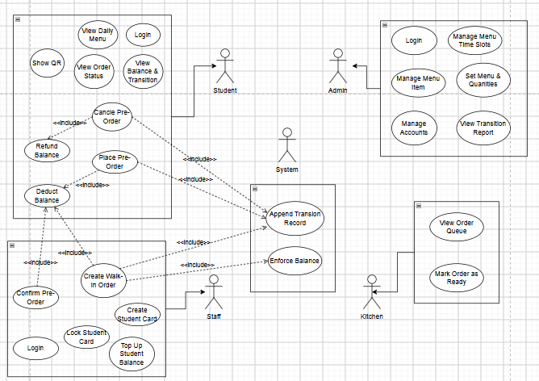

# Session Work Log

Work completed in this design/analysis session for the Student Lunch Card system.

---

## 1. Use Case Specification — `usecase.md`

Wrote a full BA-style use case document covering all 5 actors and 26 use cases.

- **Actors:** Student, Counter Staff, Kitchen, Admin, System
- Each use case has: preconditions, main flow, alternative flows, postconditions
- Includes `<<include>>` / `<<extend>>` relationship table for draw.io reference
- System use cases (Append Transaction, Enforce Balance, Expire QR, Decrement Quantity) documented separately

---

## 2. Use Case Diagram — `Usecase_diagram.png`

Drew the full use case diagram on draw.io based on the specification above.

**Actors in the diagram:**
- Student — pre-order flow, QR, balance
- Staff — walk-in, QR confirm, top-up, card management
- Admin — menu, timeslots, accounts, reports
- Kitchen — order queue, mark ready
- System — shared internal use cases (Append Transaction Record, Enforce Balance)

---

## 3. Study Notes — `notes.md`

Study notes written for reference, covering:

- UML overview (structural vs behavioral diagrams)
- Use Case Diagram — elements and notation
- Class Diagram — visibility, relationships, multiplicity
- Sequence Diagram — lifelines, message types, combined fragments
- Activity Diagram — actions, decisions, swim lanes
- State Machine Diagram — states, transition syntax
- **UI/UX from UML** — how each UML artifact maps to a screen, the design pipeline, and key principles

---

## Files in this session

| File | Description |
|---|---|
| `docs/usecase.md` | Full use case specification (BA document) |
| `docs/Usecase_diagram.png` | Use case diagram drawn on draw.io |
| `docs/notes.md` | UML + UI/UX study notes |
