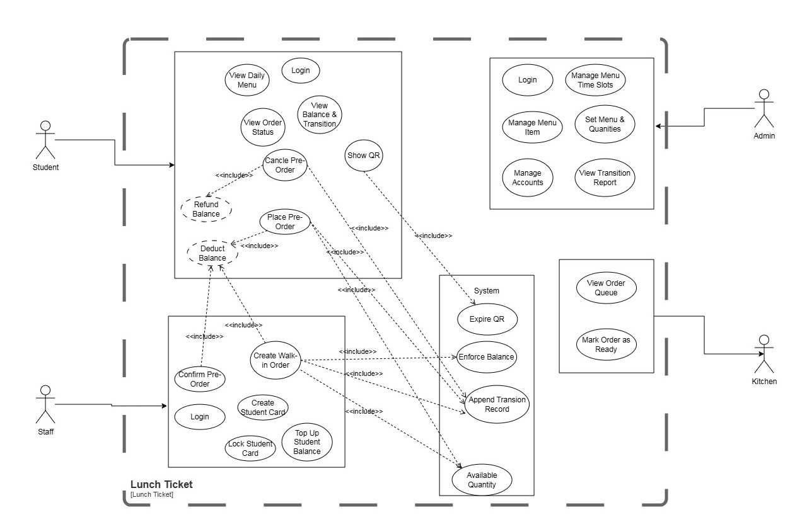
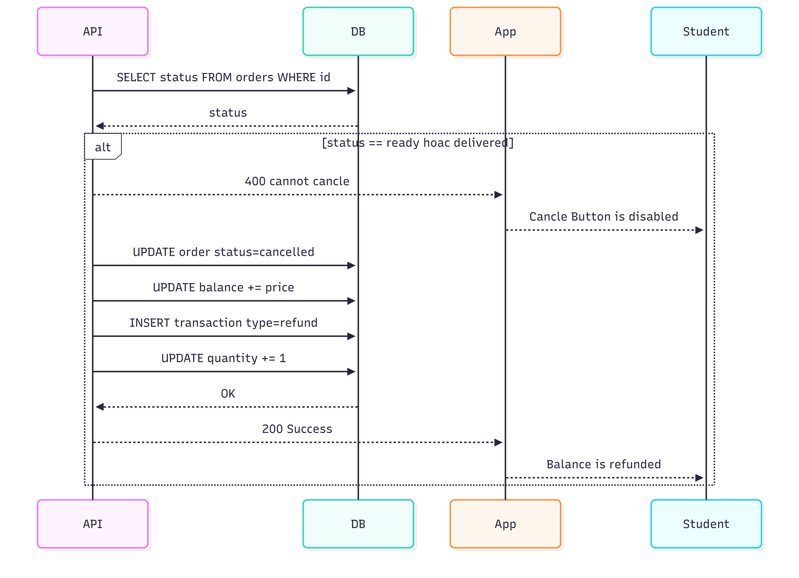
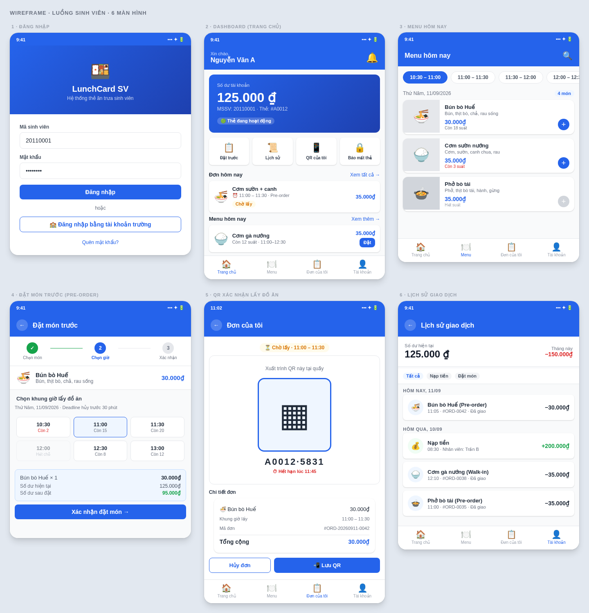
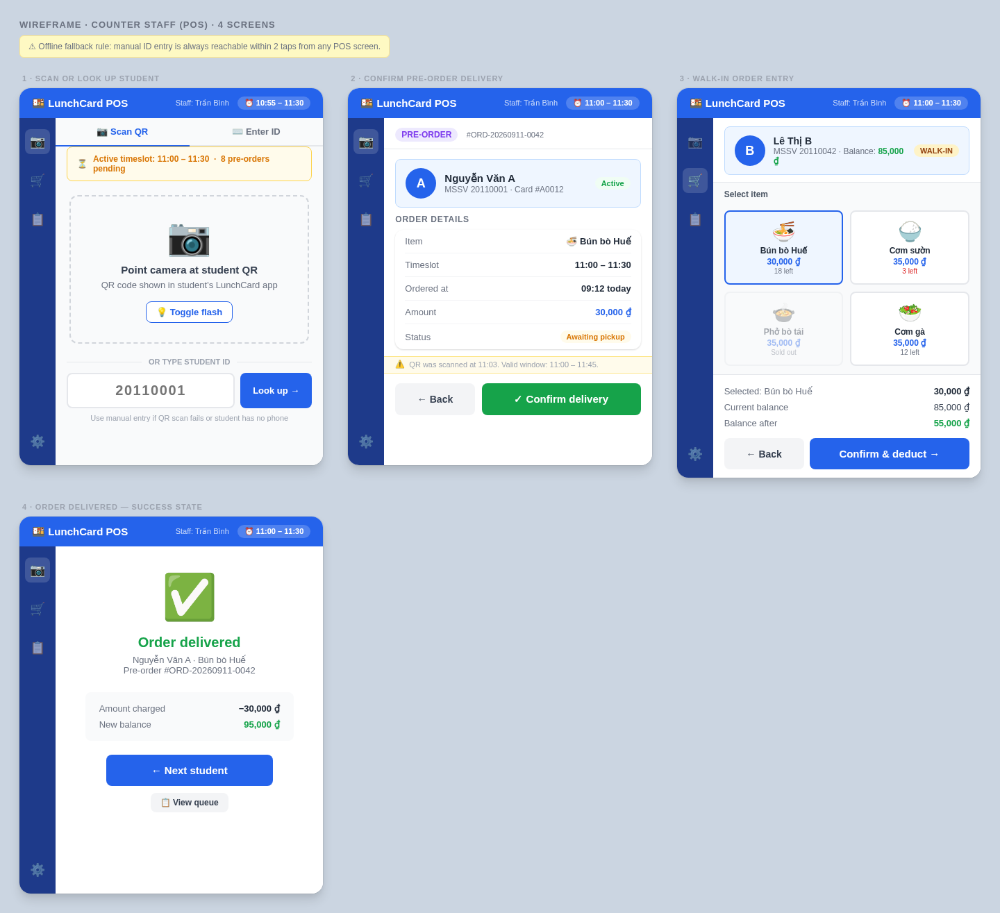
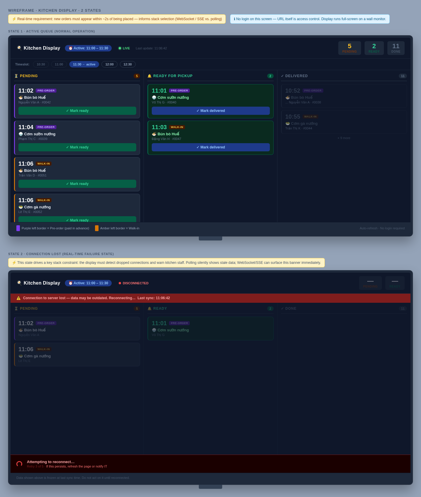

# Session Work Log

Work completed in this design/analysis session for the Student Lunch Card system. Sections are in the order the work was done, so this doubles as the pipeline: use case → ERD → sequence diagram → API traceability.

---

## 1. Use Case Specification — `usecase.md`

Wrote a full BA-style use case document covering all 5 actors and 26 use cases.

- **Actors:** Student, Counter Staff, Kitchen, Admin, System
- Each use case has: preconditions, main flow, alternative flows, postconditions
- Includes `<<include>>` / `<<extend>>` relationship table for draw.io reference
- System use cases (Append Transaction, Enforce Balance, Expire QR, Decrement Quantity) documented separately

---

## 2. Use Case Diagram — `Usecase_diagram.png`

Drew the full use case diagram on draw.io based on the specification above.

**Actors in the diagram:**
- Student — pre-order flow, QR, balance
- Staff — walk-in, QR confirm, top-up, card management
- Admin — menu, timeslots, accounts, reports
- Kitchen — order queue, mark ready
- System — shared internal use cases (Append Transaction Record, Enforce Balance)

---

## 3. Study Notes — `notes.md`

Study notes written for reference, covering:

- UML overview (structural vs behavioral diagrams)
- Use Case Diagram — elements and notation
- Class Diagram — visibility, relationships, multiplicity
- Sequence Diagram — lifelines, message types, combined fragments
- Activity Diagram — actions, decisions, swim lanes
- State Machine Diagram — states, transition syntax
- **UI/UX from UML** — how each UML artifact maps to a screen, the design pipeline, and key principles

---

## 4. ERD & Schema — `erd.md`, `schema.dbml`, `schema.sql`

Designed the entity-relationship diagram from the 9 core entities in `usecase.md`, then synced it against the actual `app/models.py` implementation to eliminate drift.

- `docs/erd.md` — Mermaid `erDiagram`, paste directly into mermaid.live; includes an FK-to-use-case mapping table
- `docs/schema.dbml` — updated to match, for dbdiagram.io visualization
- `docs/schema.sql` — generated directly from `app/models.py` via SQLAlchemy's `CreateTable`, so it can't drift from the running code
- `usecase.md` updated (UC-C02, UC-C03, UC-C04, UC-SYS01) to document staff-accountability fields (`placed_by_staff`, `delivered_by`, `source`, `actor_id`, `reference_order`) that exist in code but were missing from the BA-level spec

**Pipeline now consistent end to end:** `usecase.md` → `erd.md` / `schema.dbml` → `app/models.py` → `schema.sql`

---

## 5. Sequence Diagram Guide — `sequence-diagram-guide.md`

This is a **self-guided method, not a finished diagram** — written so the sequence diagrams themselves get designed by hand, not generated. Contains:

- Mermaid sequence syntax cheat sheet (`->>`, `-->>`, `alt/opt/loop`, `activate/deactivate`)
- A 5-step method: pick participants → walk the use case's Main Flow → convert Alt Flow to `alt`/`opt` → wrap returns → cross-check `<<include>>` system use cases show up as real messages
- One fully worked example (UC-S01 Login, intentionally trivial)
- A shortlist of 5 use cases worth diagramming next (UC-S03, UC-S04, UC-C02, UC-C03, UC-K02), each with participants pre-identified and hints, arrows left as the exercise
- A self-review checklist before calling a diagram done

**Convention going forward:** finished sequence diagrams should be saved as `docs/sequence-<use-case-id>.md` (e.g. `docs/sequence-uc-s03.md`).

**Drawn so far — UC-S04 Cancel Pre-Order:**

> Note: currently only the rendered image is checked in (`docs/UC-S04.png`); the Mermaid source hasn't been saved as `docs/sequence-uc-s04.md` yet — do that next so it's editable and traceable like the other diagrams.

---

## 6. API Traceability — `api-mapping.md`

Cross-checked every use case against the actual running code (`app/routers/*.py`, all 6 router files read directly) to catch drift between what's designed on paper and what's implemented. Swagger/OpenAPI (`/docs`) stays the source of truth for the contract itself; this file only maps **use case → real endpoint (method, path, router file)**.

Key findings, called out explicitly so they aren't mistaken for documentation oversights:

- **Admin backend gap:** UC-A02 through UC-A07 have zero implemented endpoints. `menu.py` only exposes `GET` routes; no CRUD exists for menu items, timeslots, daily menu, staff, or students, and no cross-student transaction report endpoint exists. Matches the root README's "Admin: Deferred" status, but this confirms it's a backend gap, not just a missing UI.
- **UC-S01 Login divergence:** there is no separate student login endpoint. `POST /api/auth/login` is staff-only and reused as the demo stand-in, matching the documented limitation in the root `README.md`.
- **UC-K02 Mark Ready** lives in `orders.py`, not `kitchen.py` — worth knowing before assuming otherwise in a sequence diagram.
- **UC-SYS01** (append transaction) is duplicated three times across `orders.py`/`accounts.py` rather than a shared helper — noted for awareness, not flagged as something to fix.
- UC-S04's 30-minute cancellation deadline (BR-04) is enforced in code but not yet reflected in `usecase.md`'s precondition text — a small backfill still open.

---

## 7. Wireframes — reference for the mentor

Static design reference screens, predating this session's docs work but included here so the whole visual story is in one place. Live, clickable versions are in `wireframes/<role>/index.html` (open directly in a browser, no server needed).

**Student flow** — live and wired to the API (`frontend/student/index.html`), wireframe below is the original design reference:

**Staff POS** — static wireframe only, not yet wired to the API:

**Kitchen display** — static wireframe only; the real SSE stream (`GET /api/kitchen/stream`) is live and working, just not yet wired into this screen:

**Admin** — deferred, no wireframe exists yet (see the confirmed backend gap in §6 above).

---

## Files in this session

| File | Description |
|---|---|
| `docs/usecase.md` | Full use case specification (BA document) |
| `docs/Usecase_diagram.png` | Use case diagram drawn on draw.io |
| `docs/notes.md` | UML + UI/UX study notes |
| `docs/erd.md` | Mermaid ERD + FK/use-case mapping table |
| `docs/schema.dbml` | dbdiagram.io schema (kept in sync with models.py) |
| `docs/schema.sql` | Generated `CREATE TABLE` statements from `app/models.py` |
| `docs/sequence-diagram-guide.md` | Self-guided method for designing sequence diagrams |
| `docs/UC-S04.png` | Rendered UC-S04 (Cancel Pre-Order) sequence diagram — image only, Mermaid source not yet saved |
| `docs/api-mapping.md` | Use case / sequence diagram → real endpoint traceability, plus confirmed backend gaps |
| `docs/ERD.png` | Rendered ERD image, matches `erd.md` |
| `docs/wireframe-student.png` / `-staff.png` / `-kitchen.png` | Static design references for each role |

---

## Open items / not yet done

- [ ] Save UC-S04's Mermaid source as `docs/sequence-uc-s04.md` (image exists, source doesn't)
- [ ] Remaining sequence diagrams from the guide's shortlist: UC-S03, UC-C02, UC-C03, UC-K02
- [ ] State Machine Diagram for `Order` lifecycle — discussed, not started
- [ ] Backfill BR-04 (cancellation deadline) into `usecase.md` UC-S04
- [ ] Admin backend implementation — confirmed missing, not scoped yet
