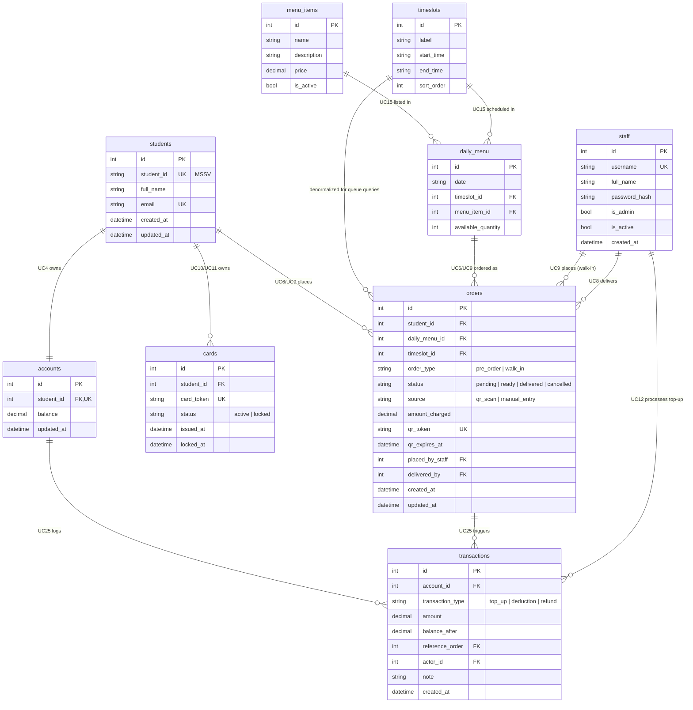

# Entity-Relationship Diagram — Student Lunch Card System

Fills the ERD gap flagged in `docs/architecture/README.md` and `docs/architecture/c4/container.md`. Adapted from an earlier prototype's schema (`main` branch, not part of this branch's history) — table/column design and UC references below were re-checked against this branch's `docs/investment/usecase.md` (UC1–UC28) and `docs/investment/requirements.md`. Source of truth is `lunchcard.db`'s live schema; no ORM/model layer has been chosen yet for this branch (see `CLAUDE.md` flags). Paste the block below into [mermaid.live](https://mermaid.live) to render.

## FK relationships and the use cases they support

UC numbers below match `docs/investment/usecase.md` (UC1–UC28) on this branch.

| FK | Relationship | Use case(s) |
|---|---|---|
| `accounts.student_id → students.id` | 1–1 | UC4 (view balance), UC12 (top-up). Balance decoupled from card (non-negotiable principle #1). |
| `cards.student_id → students.id` | 1–N | UC11 (lock card), UC10 (create/issue new card). Old locked card + new active card coexist; balance carries over. |
| `orders.student_id → students.id` | 1–N | UC6 (place pre-order), UC9 (create walk-in). Every order belongs to exactly one student. |
| `orders.daily_menu_id → daily_menu.id` | 1–N | UC6, UC9. Ties order to item+timeslot+date; drives `available_quantity` decrement (UC28). |
| `orders.timeslot_id → timeslots.id` | 1–N | UC18 (view order queue). Denormalized so the kitchen queue can filter/sort by timeslot without joining through `daily_menu`. |
| `orders.placed_by_staff → staff.id` | 1–N, nullable | UC9. Null for pre-orders (student self-service); set for walk-ins. |
| `orders.delivered_by → staff.id` | 1–N, nullable | UC8 (confirm pre-order). Which staff member confirmed pickup (QR scan or manual). |
| `daily_menu.menu_item_id → menu_items.id` | N–N junction (with `timeslots`) | UC15 (set menu & quantities). `daily_menu` carries the relationship-specific attribute `available_quantity`. |
| `daily_menu.timeslot_id → timeslots.id` | N–N junction | UC15. |
| `transactions.account_id → accounts.id` | 1–N | UC25 (append transaction record), triggered by UC6/UC7/UC9/UC12. Append-only balance ledger. |
| `transactions.reference_order → orders.id` | 1–N, nullable | UC6 (deduction), UC7 (refund). Null for top-ups (UC12) since those aren't tied to an order. |
| `transactions.actor_id → staff.id` | 1–N, nullable | UC12. Records which staff member processed a top-up; null for student-triggered deductions/refunds. |

## Known gap this closes, and what's still open

- This was the primary gap called out in `docs/architecture/README.md` ("No ERD document exists"). That flag can be removed once this file is reviewed.
- QR expiry and cancellation-refund business rules are now confirmed (`docs/investment/requirements.md` "Resolved business rules"): QR is **one-time-use only** (invalidated on first successful scan, no time-based duration), and cancellation refund is **100%/50%** split at a 2-hour-before-timeslot cutoff. Since QR expiry is one-time-use rather than time-based, `orders.qr_expires_at` is not needed for that check; it's retained in the live schema as a nullable column and can be repurposed (e.g. as a safety-net end-of-day cap) or dropped in a future migration — not altered here since `lunchcard.db`'s schema is inherited, not owned by this branch.
- Which language/ORM will read and write this schema (Entity Framework Core vs. another approach, per the .NET backend decision) is not decided yet — flagged separately in `CLAUDE.md`, not assumed here.
