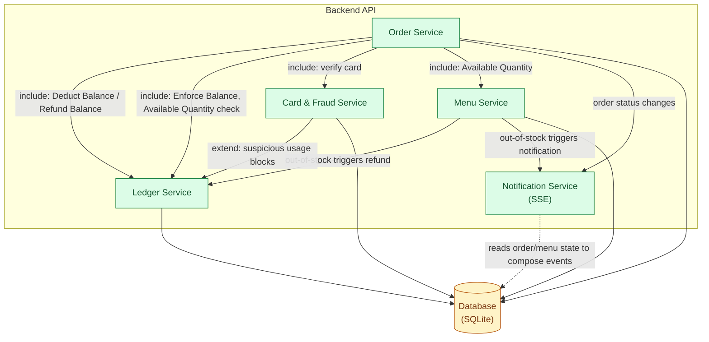

# C4 Level 3 — Component (Backend API)

Source of truth: `docs/investment/usecase.md`, `docs/investment/requirements.md`.

Zooming into the **Backend API** container from `container.md`. Components are grouped by the actual use-case groupings in `requirements.md`, not a generic CRUD-per-entity template — the reasoning for each grouping is below the diagram.

## Components and reasoning

| Component | Use cases it owns | Why it's a separate component |
|---|---|---|
| **Order Service** | Place Pre-Order, Cancel Pre-Order, Confirm Pre-Order, Create Walk-in Order, View Order Status, View Order Queue, Mark Order as Ready | The core order lifecycle and the pre-order/walk-in queue separation (non-negotiable design principle) live here. It orchestrates the other services but doesn't own money or stock itself. |
| **Ledger Service** | Deduct Balance, Refund Balance, Append Transaction Record, Enforce Balance, Top Up Student Balance, View Balance & Transaction, View Transaction Report | `requirements.md` Group 1 is explicit that balance mutation + transaction-record creation must be atomic and independently auditable. Isolating this as its own component makes that atomicity boundary enforceable in code (one service, one transaction) instead of scattered across whichever use case happens to touch money. This is the component most directly tied to Pain Point 1 (financial risk), the system's top priority. |
| **Card & Fraud Service** | Login, Create Student Card, Lock Student Card, Detect Suspicious Card Usage | Card identity/lifecycle and fraud detection are grouped together because Detect Suspicious Card Usage `<<extend>>`s the payment path at the point of card verification — it's a concern of "is this card being presented legitimately," not of order or money logic. Keeping it separate from Ledger Service means a fraud flag can block a Deduct Balance call without the Ledger needing to know anything about fraud rules. |
| **Menu Service** | Manage Menu Item, Manage Menu Time Slots, Set Menu & Quantities, View Daily Menu, Available Quantity, Report Item Out of Stock | Everything about what's orderable and in what quantity. Report Item Out of Stock lives here (not in Order Service) because it mutates Available Quantity directly — the same state Menu Service already owns for Set Menu & Quantities — and only *triggers* Order/Notification concerns rather than owning them. |
| **Notification Service** | Receive Stock-Out Notification, Show QR, Expire QR | Grouped together because both are the two concrete SSE consumers/producers in the current use case set (Group 2's stock-out alert and Group 3's QR lifecycle), and both are "tell the client something changed" concerns rather than business-rule concerns. This isolates the one real-time/SSE fan-out mechanism so Order Service, Menu Service, etc. only need to call one interface ("notify") instead of each owning their own push logic. |

**Note on Admin/Manage Accounts**: Manage Accounts is owned by Card & Fraud Service (it's account/identity lifecycle, same concern as Create/Lock Student Card) — listed under that component in the diagram below, not a separate "Admin Service," since there's no Admin-specific business logic beyond identity and menu management, both of which already have a home.

## Diagram

## Traceability back to use cases

| Component | `usecase.md` use cases |
|---|---|
| Order Service | UC6 Place Pre-Order, UC7 Cancel Pre-Order, UC8 Confirm Pre-Order, UC9 Create Walk-in Order, UC3 View Order Status, UC18 View Order Queue, UC19 Mark Order as Ready |
| Ledger Service | UC23 Deduct Balance, UC24 Refund Balance, UC25 Append Transaction Record, UC26 Enforce Balance, UC12 Top Up Student Balance, UC4 View Balance & Transaction, UC17 View Transaction Report |
| Card & Fraud Service | UC1 Login, UC10 Create Student Card, UC11 Lock Student Card, UC22 Detect Suspicious Card Usage, UC16 Manage Accounts |
| Menu Service | UC13 Manage Menu Item, UC14 Manage Menu Time Slots, UC15 Set Menu & Quantities, UC2 View Daily Menu, UC28 Available Quantity, UC20 Report Item Out of Stock |
| Notification Service | UC21 Receive Stock-Out Notification, UC5 Show QR, UC27 Expire QR |
