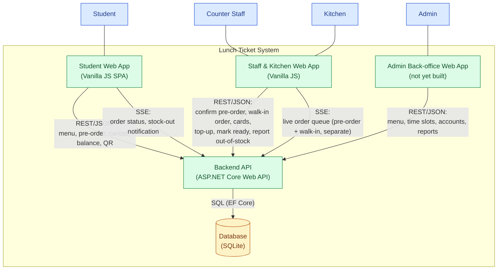

# C4 Level 2 — Container

Source of truth: `docs/investment/usecase.md`, `docs/investment/requirements.md`, `CLAUDE.md` (stack), and the live schema in `lunchcard.db` at the repo root.

**Note on scope**: as with Level 1, no prior container diagram existed in this repo — this is newly authored, not a revision.

## Containers

| Container | Technology | Actors served | Notes |
|---|---|---|---|
| Student Web App | Vanilla JS SPA (`frontend/student/`) | Student | Only frontend that's actually wired to a live API today per CLAUDE.md's current-state table |
| Staff & Kitchen Web App | Vanilla JS (POS + kitchen display) | Counter Staff, Kitchen | POS and kitchen display are separate screens of the same static wireframe today; modeled as one container since they share the same backend contract |
| Admin Back-office Web App | Web (deferred — wireframes not yet started per CLAUDE.md) | Admin | Included because Admin use cases exist in `usecase.md`; flagged as not yet built |
| Backend API | ASP.NET Core Web API (C#) | all actors, via the frontends | Owns REST endpoints and the SSE stream endpoint (`GET /api/kitchen/stream` per CLAUDE.md) |
| Database | SQLite (Entity Framework Core, Code-First) | — | See "ERD gap" note below |

## Diagram

## Ledger implications for the Database container

`docs/investment/requirements.md` Group 1 (Deduct Balance, Refund Balance, Append Transaction Record, Enforce Balance) requires balance updates and their audit trail to be atomic. The live schema in `lunchcard.db` already reflects this as a deliberate design, not an afterthought:

- `accounts` — one row per student, `balance NUMERIC`, `CHECK (balance >= 0)` enforced at the DB level (backs Enforce Balance).
- `transactions` — `account_id`, `transaction_type`, `amount`, `balance_after`, tied 1:1 with each `accounts.balance` mutation (backs Append Transaction Record's audit-trail requirement).
- `cards` — separate table from `accounts`, linked only by `student_id`, with its own `status`/`locked_at` — the physical structure that makes "money decoupled from the card" enforceable rather than just a stated principle.
- `orders` — carries `qr_token`/`qr_expires_at` directly, which is what Show QR / Expire QR (Group 3) map onto.

**ERD gap**: closed — `docs/api/erd.md` and `docs/api/schema.dbml` now document the canonical ERD, matching `lunchcard.db`'s live schema.

## SSE channel reuse

Both the kitchen order queue (existing) and stock-out notifications (new depth area) ride the same SSE endpoint conceptually — no second real-time channel is introduced. This is called out explicitly because it's one of the architecture decisions recorded in `arc42/arc42.md` §9.
