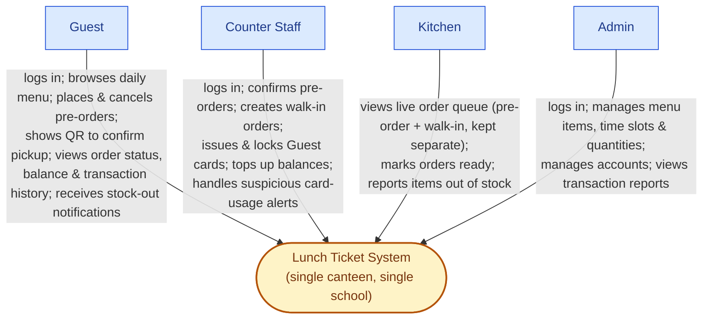

# C4 Level 1 — System Context

Source of truth: `docs/investment/usecase.md`, `docs/investment/requirements.md`.

**Note on scope**: no prior C4 diagrams existed anywhere in this repo before this file — there was no earlier `context.md` to review or update. This is a newly authored diagram derived directly from the current use case diagram, not a revision of an older one.

No technology names appear at this level — only the system as a whole and the human actors around it, consistent with C4 Level 1 conventions.

## Diagram

## Notes

- The 4 actors match `docs/investment/usecase.md` exactly — no new actors introduced (per the non-negotiable design principle that the actor set doesn't expand).
- Interaction labels are grouped by actor rather than listing all 28 use cases individually; the full breakdown is in `docs/investment/usecase.md`'s traceability table.
- The two areas that weren't in scope for an earlier, simpler take on this system — QR-based pickup and stock-out reporting/notification — are represented here since they're part of the current use case diagram (Group 2 and Group 3 in `docs/investment/requirements.md`).
- Money never appears as a separate actor or external system at this level; it's modeled as behavior *inside* the system boundary (the Ledger use cases), consistent with the non-negotiable principle that balance is decoupled from the physical card.
