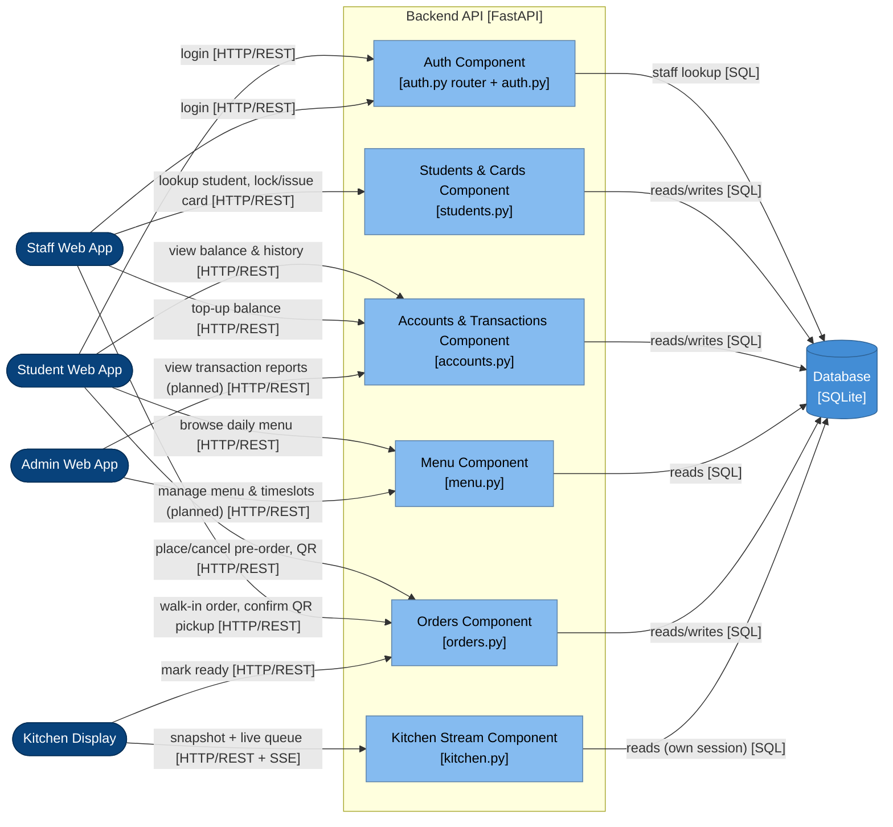

# C4 Model — Level 3: Component

Zooms into the "Backend API [FastAPI]" container from `container.md`.
Components are drawn from the actual code structure (`app/routers/*.py` +
`app/auth.py`), not a generic textbook layout. See the explanation above
this file (session notes) for the three ways the real structure diverges
from a typical "Order/Balance/Menu/Auth service" split:

1. No service layer — logic lives directly in router functions.
2. No shared Balance/Payment component — debit/credit/refund logic is
   duplicated inline in both `orders.py` and `accounts.py`.
3. "Mark ready" is implemented in the **Orders** component (`orders.py`),
   not the **Kitchen Stream** component (`kitchen.py`), even though it's
   conceptually a kitchen action. Kitchen Stream is read-only (SSE +
   snapshot) and uses its own DB session per tick instead of the shared
   `get_db` dependency.

Admin → Menu / Accounts arrows are marked `(planned)` — `menu.py` is
GET-only today and no reports endpoint exists yet, matching the "Admin
deferred" status in `CLAUDE.md`.

