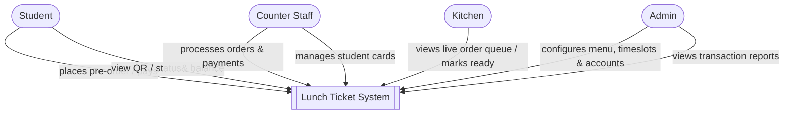

# C4 Model — Level 1: System Context

Student Lunch Card System. Actors sourced from `docs/usecase.md`.

Note: `usecase.md` lists "System" as a secondary actor (balance rules, QR
expiry, queue separation, transaction integrity). At this level that is
internal behavior of the system itself, not an external actor — so it is
absorbed into the "Lunch Ticket System" box rather than drawn separately.

