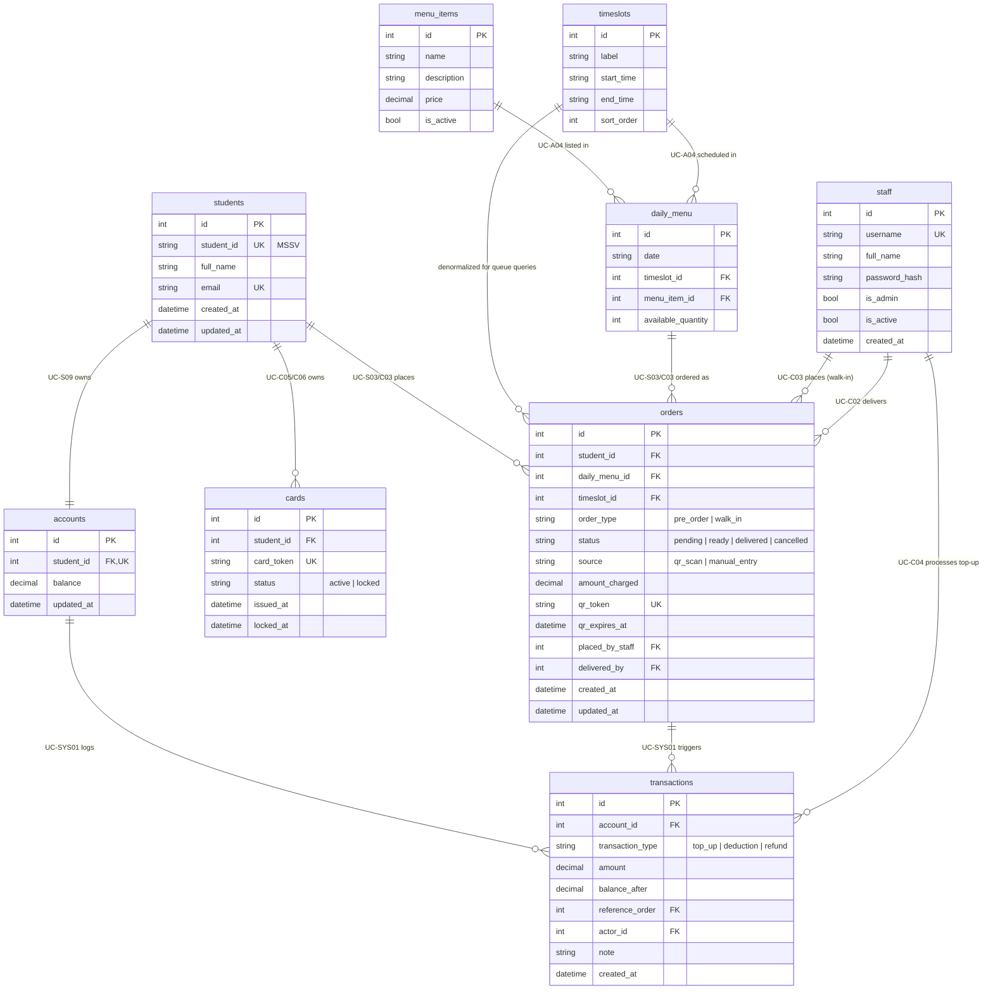

# Entity-Relationship Diagram — Student Lunch Card System

Source of truth: `app/models.py`. Mirrored in `docs/schema.dbml` (dbdiagram.io) and `docs/schema.sql` (generated `CREATE TABLE` statements). Paste the block below into [mermaid.live](https://mermaid.live) to render.

## FK relationships and the use cases they support

| FK | Relationship | Use case(s) |
|---|---|---|
| `accounts.student_id → students.id` | 1–1 | UC-S09 (view balance), UC-C04 (top-up). Balance decoupled from card (non-negotiable principle #1). |
| `cards.student_id → students.id` | 1–N | UC-C05 (lock card), UC-C06 (issue new card). Old locked card + new active card coexist; balance carries over. |
| `orders.student_id → students.id` | 1–N | UC-S03, UC-C03. Every order belongs to exactly one student. |
| `orders.daily_menu_id → daily_menu.id` | 1–N | UC-S03, UC-C03. Ties order to item+timeslot+date; drives `available_quantity` decrement (UC-SYS04). |
| `orders.timeslot_id → timeslots.id` | 1–N | UC-K01 (kitchen queue). Denormalized so the SSE queue can filter/sort by timeslot without joining through `daily_menu`. |
| `orders.placed_by_staff → staff.id` | 1–N, nullable | UC-C03. Null for pre-orders (student self-service); set for walk-ins. |
| `orders.delivered_by → staff.id` | 1–N, nullable | UC-C02. Which staff member confirmed pickup (QR scan or manual). |
| `daily_menu.menu_item_id → menu_items.id` | N–N junction (with `timeslots`) | UC-A04. `daily_menu` carries the relationship-specific attribute `available_quantity`. |
| `daily_menu.timeslot_id → timeslots.id` | N–N junction | UC-A04. |
| `transactions.account_id → accounts.id` | 1–N | UC-SYS01, triggered by UC-S03/S04/C03/C04. Append-only balance ledger. |
| `transactions.reference_order → orders.id` | 1–N, nullable | UC-S03 (deduction), UC-S04 (refund). Null for top-ups (UC-C04) since those aren't tied to an order. |
| `transactions.actor_id → staff.id` | 1–N, nullable | UC-C04. Records which staff member processed a top-up; null for student-triggered deductions/refunds. |

## Notes on divergence from the simplified BA-level ERD

The earlier draft (given directly in chat, not saved to a file) covered only the 9 core entities from the use case spec. This version adds the staff-accountability columns that already exist in `app/models.py` — `orders.source/placed_by_staff/delivered_by`, `orders.timeslot_id`, and `transactions.reference_order/actor_id/note` — so that `usecase.md`, `schema.dbml`, this ERD, and `schema.sql` all describe the same schema with no drift.
