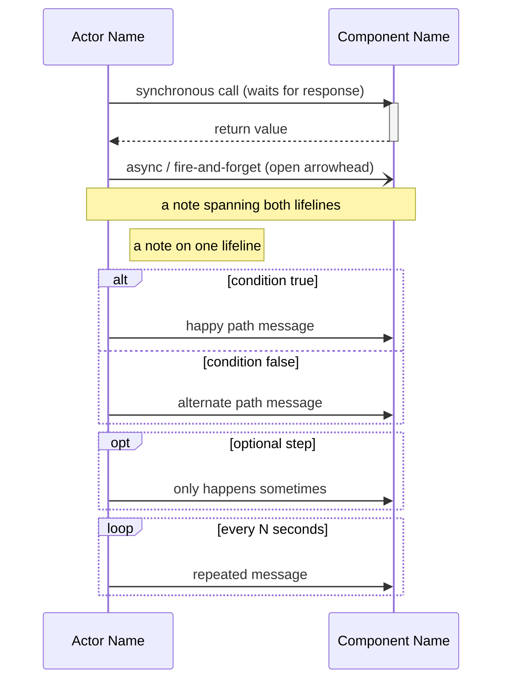
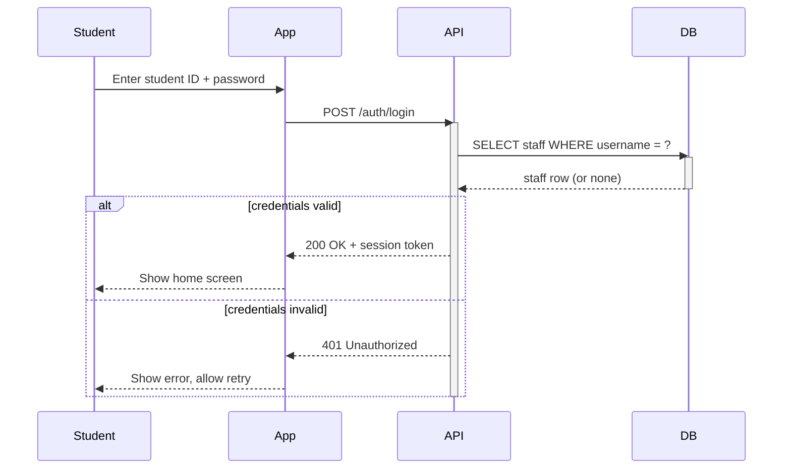

# How to Design a Sequence Diagram (self-guided)

This is a **method + cheat sheet**, not a finished diagram. Work through it use case by use case and build your own `.mmd` blocks. One fully worked example is included so you can see the pattern before doing the rest yourself.

---

## 1. What a sequence diagram shows

*In what order do participants exchange messages to complete one use case?*

It is the **behavioral zoom-in** on a single flow you already defined in `usecase.md`. If the use case's Main Flow is numbered steps in prose, the sequence diagram is that same list turned into arrows between participants.

---

## 2. Mermaid sequence syntax — cheat sheet



| Syntax | Meaning |
|---|---|
| `participant X as Label` | Declares a lifeline. Order left-to-right = declaration order. |
| `->>` | Solid arrow, synchronous call |
| `-->>` | Dashed arrow, return message |
| `-)` | Open arrow, async / fire-and-forget |
| `activate` / `deactivate` | Draws the thin "busy" bar on a lifeline (optional but recommended for anything with a return) |
| `alt / else / end` | If/else branching — use for your use case's Alt Flow |
| `opt / end` | One optional branch, no else |
| `loop / end` | Repetition (e.g. SSE polling) |
| `Note over A,B: text` | Annotation, good for stating a business rule inline |

---

## 3. The 5-step method: use case → sequence diagram

### Step 1 — Pick the participants
Look at the use case's actor plus every system component it touches. For this project, the recurring participants are:

| Participant | Represents |
|---|---|
| The actor (Student / Staff / Kitchen / Admin) | The human triggering the flow |
| `App` | The frontend (`frontend/student/app.js` or staff POS UI) |
| `API` | The FastAPI backend (a specific router, e.g. `orders.py`) |
| `DB` | SQLite via SQLAlchemy |
| (sometimes) `SSE Stream` | The kitchen live-update channel |

Don't add a participant that doesn't send or receive at least one message.

### Step 2 — Walk the Main Flow numbered steps
Open the use case in `usecase.md`. Its **Main Flow** is already a numbered list — that list *is* your message sequence in prose form. Convert each numbered step into one arrow.

### Step 3 — Add the Alt Flow as `alt`/`opt`
Every **Alt Flow** entry in the use case becomes a branch. Ask: does this alternate path always get evaluated (→ `alt/else`), or does it only sometimes trigger (→ `opt`)?

### Step 4 — Add `activate`/`deactivate` around anything that returns a value
If a message expects a response, wrap it. This keeps the diagram readable when multiple calls happen back-to-back.

### Step 5 — Cross-check against `<<include>>` relationships
If the use case includes a system use case (UC-SYS01 Append Transaction, UC-SYS02 Enforce Balance, UC-SYS04 Decrement Quantity — see the Relationships table at the bottom of `usecase.md`), those need to show up as real messages/notes in the diagram — they are not optional just because they're "internal."

---

## 4. Worked example — UC-S01 Login

Source (from `usecase.md`):
> 1. Student opens the app → enters student ID and password. 2. System validates credentials. 3. System returns session token; app shows home screen.
> Alt: 2a. Invalid credentials → system shows error; student retries.



Notice the mapping:
- Numbered step 1 → `Student->>App` and `App->>API`
- Step 2 ("System validates") → `API->>DB` / `DB-->>API`
- Step 3 → the `alt` block's success branch
- Alt Flow 2a → the `else` branch

---

## 5. Your turn — use cases worth diagramming, with participants pre-picked

Don't just do one. A sequence diagram set is usually built for the flows that are **complex, multi-actor, or state-changing** — not trivial CRUD. Below is a shortlist from `usecase.md`, in priority order, each with participants named for you but the arrows left for you to derive using the method above.

### UC-S03 — Place Pre-Order (do this one first — it's the most important flow in the system)
Participants: `Student, App, API (orders.py), DB, SSE Stream`
Hint: this one must show UC-SYS02 (balance check) and UC-SYS04 (quantity decrement) as real steps, and the alt flow has **two** failure branches (insufficient balance / sold out) — use `alt/else if/else`.

### UC-S04 — Cancel Pre-Order
Participants: `Student, App, API (orders.py), DB`
Hint: mirror of UC-S03 but refund direction — reuse the same shape, flip the sign.

### UC-C02 — Confirm Pre-Order (QR Scan)
Participants: `Staff, POS App, API (orders.py), DB`
Hint: the alt flow branches on **token state**, not balance — expired token, not-found token, already-delivered order are three distinct outcomes.

### UC-C03 — Create Walk-In Order
Participants: `Staff, POS App, API (orders.py), DB, SSE Stream`
Hint: same balance/quantity checks as UC-S03, but the order needs `placed_by_staff` set and it must show up in a **separate** queue on the SSE stream — say so explicitly with a `Note`.

### UC-K02 — Mark Order as Ready (good one to learn `loop`/SSE push pattern)
Participants: `Kitchen Staff, Kitchen Display, API (kitchen.py), DB, SSE Stream`
Hint: this is where you show the SSE broadcast — one action from Kitchen fans out to every connected client. You can show this as one `API-)SSE Stream: broadcast` async arrow.

---

## 6. Common mistakes checklist

- [ ] Did you name a participant that never sends or receives a message? Remove it.
- [ ] Did every arrow that expects a response get a return arrow (`-->>`)?
- [ ] Did you turn every **Alt Flow** row from the use case table into an `alt`/`opt` block — not just describe it in a note?
- [ ] Did you show `<<include>>` system use cases (balance check, transaction append, quantity decrement) as actual messages, not skip them because they're "internal"?
- [ ] Does the diagram title match the use case ID (e.g. "Sequence: UC-S03 Place Pre-Order") so it's traceable back to `usecase.md`?
- [ ] Left-to-right participant order — did you put the initiating actor on the far left?

---

## 7. Where these fit in the pipeline

```
usecase.md  (Main Flow + Alt Flow prose)
      ↓
Sequence Diagram   ← you are here
      ↓
Confirms the ERD's FK usage is correct (e.g. does the sequence actually need transactions.reference_order? yes — UC-S03 does)
      ↓
Feeds directly into API design / endpoint contracts (each arrow to API = one endpoint call)
```

Save your finished diagrams as `docs/sequence-<use-case-id>.md` (e.g. `docs/sequence-uc-s03.md`) so each stays traceable to its use case, same pattern as `erd.md`.
