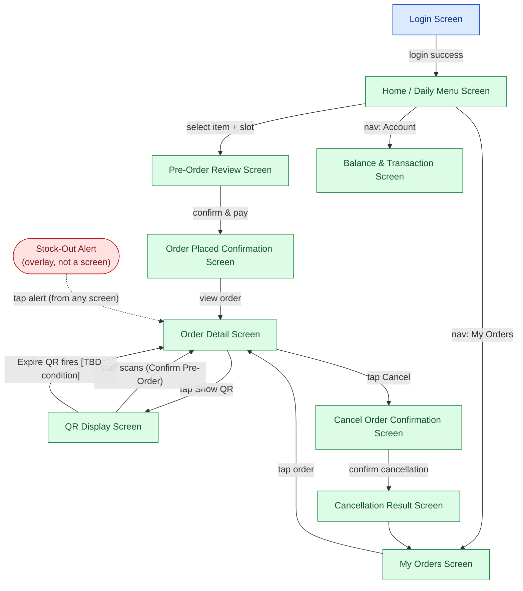
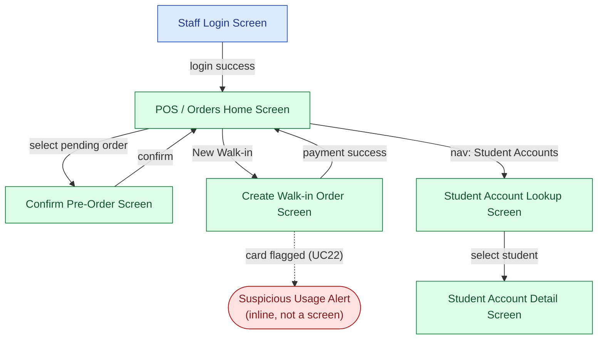
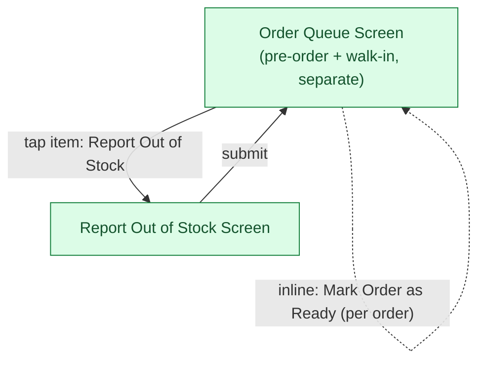
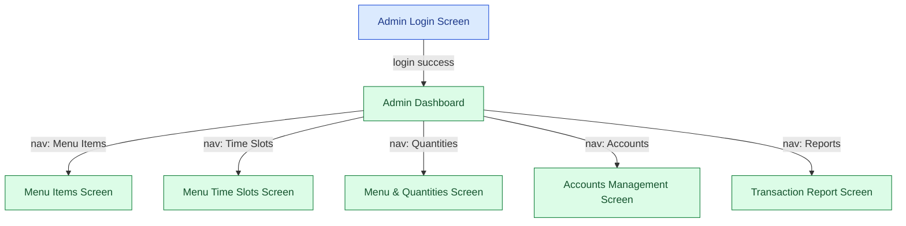

# Information Architecture & Screens Hierarchy — Lunch Ticket System

Source of truth: `docs/investment/usecase.md` (use cases, actor associations), `docs/investment/requirements.md` (business rules). Structure and navigation only — no layout, components, or visual design. This is the reference for hand-drawn UI/UX mockups to follow.

---

## Student

### 1. Information Architecture

Derived from the Student's 8 use cases (UC1, UC2, UC3, UC4, UC5, UC6, UC7, UC21). Three top-level sections plus one cross-cutting concern:

| Section | Use cases | Why grouped together |
|---|---|---|
| **Ordering** | UC2 View Daily Menu, UC6 Place Pre-Order | Browsing and placing a pre-order are one continuous task — there's no use case that justifies splitting menu browsing from ordering into separate top-level sections. |
| **My Orders** | UC3 View Order Status, UC7 Cancel Pre-Order, UC5 Show QR | All three act on an *existing* order (status, cancel, pickup) rather than creating a new one — they belong with the order, not with Ordering. |
| **Account** | UC4 View Balance & Transaction | Money-facing, distinct from ordering/pickup tasks. |
| *(cross-cutting)* Stock-out alerts | UC21 Receive Stock-Out Notification | Not a section a Student navigates to — it's a push notification that can arrive on top of any screen. See flag below. |

**Flag**: UC21 (Receive Stock-Out Notification) doesn't map to a dedicated navigable screen — it's an interrupt/overlay (SSE-pushed toast or banner) that routes into My Orders → Order Detail when tapped, rather than a section of its own. Noted here instead of silently inventing a "Notifications" tab that no use case asks for.

### 2. Screens Hierarchy

| # | Screen | Maps to use case(s) | Reached from | Leads to (on action/event) |
|---|---|---|---|---|
| 1 | Login Screen | UC1 Login | App entry | → Home on success |
| 2 | Home / Daily Menu Screen | UC2 View Daily Menu | Login; nav bar | → Pre-Order Review on "select item + slot" |
| 3 | Pre-Order Review Screen | UC6 Place Pre-Order (review step) | Home | → Order Placed Confirmation on "confirm & pay" |
| 4 | Order Placed Confirmation Screen | UC6 Place Pre-Order (result) | Pre-Order Review | → Order Detail on "view order" |
| 5 | My Orders Screen (list) | UC3 View Order Status (list view) | Nav bar; Cancellation Result | → Order Detail on "tap order" |
| 6 | Order Detail Screen | UC3 View Order Status (detail view); hub for QR/Cancel | My Orders; Order Placed Confirmation; Stock-Out Alert (tap) | → QR Display on "Show QR"; → Cancel Confirmation on "Cancel" |
| 7 | QR Display Screen | UC5 Show QR | Order Detail | → Order Detail on staff scan/confirm, or on Expire QR |
| 8 | Cancel Order Confirmation Screen | UC7 Cancel Pre-Order (refund preview) | Order Detail | → Cancellation Result on "confirm cancellation" |
| 9 | Cancellation Result Screen | UC7 Cancel Pre-Order (result) | Cancel Confirmation | → My Orders |
| 10 | Balance & Transaction Screen | UC4 View Balance & Transaction | Nav bar | — (leaf screen) |
| — | Stock-Out Alert (overlay/toast, not a full screen) | UC21 Receive Stock-Out Notification | Pushed via SSE on top of any screen | → Order Detail on tap |

**Entry/exit notes**:
- QR Display → Order Detail covers both exit paths: a successful staff scan (Confirm Pre-Order, Staff-side) and Expire QR firing without a scan. The exact expiry condition is `[TBD]` per `requirements.md`; regardless of which condition fires, the screen returns to Order Detail (showing either "picked up" or "QR expired, tap to regenerate").
- Cancellation Result always returns to My Orders (list), not back to Order Detail, since the order is no longer active.

### 3. Diagram

**Screen list (reference order):**
1. Login Screen
2. Home / Daily Menu Screen
3. Pre-Order Review Screen
4. Order Placed Confirmation Screen
5. My Orders Screen
6. Order Detail Screen
7. QR Display Screen
8. Cancel Order Confirmation Screen
9. Cancellation Result Screen
10. Balance & Transaction Screen
*(+ Stock-Out Alert — overlay, not a standalone screen)*

---

## Counter Staff

### 1. Information Architecture

Derived from Staff's 7 use cases (UC1, UC8, UC9, UC10, UC11, UC12, UC22). Two sections:

| Section | Use cases |
|---|---|
| **Orders** | UC8 Confirm Pre-Order, UC9 Create Walk-in Order |
| **Student Accounts** | UC10 Create Student Card, UC11 Lock Student Card, UC12 Top Up Student Balance |

**Flag**: UC22 (Detect Suspicious Card Usage) doesn't map to its own screen — per `docs/architecture/c4/component.md`, it's an `<<extend>>` of the payment path, so it surfaces as an inline alert during Create Walk-in Order (or wherever a card is scanned), not a dedicated section or screen.

### 2. Screens Hierarchy

| # | Screen | Maps to use case(s) | Reached from | Leads to |
|---|---|---|---|---|
| 1 | Staff Login Screen | UC1 Login | App entry | → POS Home on success |
| 2 | POS / Orders Home Screen | (hub — see flag) | Login | → Confirm Pre-Order on "select pending order"; → Create Walk-in Order on "New Walk-in" |
| 3 | Confirm Pre-Order Screen | UC8 Confirm Pre-Order | POS Home | → POS Home on confirm |
| 4 | Create Walk-in Order Screen | UC9 Create Walk-in Order | POS Home | → POS Home on payment success; inline Suspicious-Usage Alert on flag (UC22) |
| 5 | Student Account Lookup Screen | supports UC10/UC11/UC12 (search step) | Nav bar | → Student Account Detail on "select student" |
| 6 | Student Account Detail Screen | UC10 Create Student Card, UC11 Lock Student Card, UC12 Top Up Student Balance | Student Account Lookup | — (leaf; actions performed inline) |

**Flag**: POS / Orders Home Screen is a navigational hub, not itself produced by a single use case — it exists to list pending pre-orders and offer "New Walk-in," which is reasonable given UC8/UC9 both need a landing point, but noting it rather than silently treating it as use-case-backed.

### 3. Diagram

**Screen list:**
1. Staff Login Screen
2. POS / Orders Home Screen
3. Confirm Pre-Order Screen
4. Create Walk-in Order Screen
5. Student Account Lookup Screen
6. Student Account Detail Screen
*(+ Suspicious Usage Alert — inline overlay, not a standalone screen)*

---

## Kitchen

### 1. Information Architecture

Derived from Kitchen's 3 use cases (UC18, UC19, UC20). Two sections:

| Section | Use cases |
|---|---|
| **Queue** | UC18 View Order Queue, UC19 Mark Order as Ready |
| **Stock** | UC20 Report Item Out of Stock |

**Flag**: `docs/investment/usecase.md` has no Login use case associated with the Kitchen actor (unlike Student/Staff/Admin, which all have UC1). This document assumes Kitchen is a shared, always-on display device with no per-user login, consistent with CLAUDE.md describing it as a "read-only display (auto-refresh)." Flagging this assumption rather than silently adding a Login screen Kitchen's use cases don't ask for.

### 2. Screens Hierarchy

| # | Screen | Maps to use case(s) | Reached from | Leads to |
|---|---|---|---|---|
| 1 | Order Queue Screen | UC18 View Order Queue, UC19 Mark Order as Ready (inline action) | App entry (no login) | → Report Out of Stock Screen on "Report Out of Stock" |
| 2 | Report Out of Stock Screen | UC20 Report Item Out of Stock | Order Queue | → Order Queue on submit |

**Flag**: UC19 (Mark Order as Ready) doesn't get its own screen — it's modeled as an inline action (a button per order) on the Order Queue Screen, since the use case doesn't describe any additional detail view beyond the queue itself.

### 3. Diagram

**Screen list:**
1. Order Queue Screen (Mark Ready is an inline action here, not a separate screen)
2. Report Out of Stock Screen

---

## Admin

### 1. Information Architecture

Derived from Admin's 6 use cases (UC1, UC13, UC14, UC15, UC16, UC17). Three sections:

| Section | Use cases |
|---|---|
| **Menu Management** | UC13 Manage Menu Item, UC14 Manage Menu Time Slots, UC15 Set Menu & Quantities |
| **Accounts** | UC16 Manage Accounts |
| **Reports** | UC17 View Transaction Report |

### 2. Screens Hierarchy

| # | Screen | Maps to use case(s) | Reached from | Leads to |
|---|---|---|---|---|
| 1 | Admin Login Screen | UC1 Login | App entry | → Admin Dashboard on success |
| 2 | Admin Dashboard | (nav hub — see flag) | Login | → any section screen via nav |
| 3 | Menu Items Screen | UC13 Manage Menu Item | Dashboard | — |
| 4 | Menu Time Slots Screen | UC14 Manage Menu Time Slots | Dashboard | — |
| 5 | Menu & Quantities Screen | UC15 Set Menu & Quantities | Dashboard | — |
| 6 | Accounts Management Screen | UC16 Manage Accounts | Dashboard | — |
| 7 | Transaction Report Screen | UC17 View Transaction Report | Dashboard | — |

**Flag**: Admin Dashboard, like Staff's POS Home, is a navigational hub not produced by any single use case — noted rather than assumed away. Per `CLAUDE.md`, Admin wireframes are deferred/not yet started, so this hierarchy is derived purely from the use case diagram, not from any existing design reference.

### 3. Diagram

**Screen list:**
1. Admin Login Screen
2. Admin Dashboard
3. Menu Items Screen
4. Menu Time Slots Screen
5. Menu & Quantities Screen
6. Accounts Management Screen
7. Transaction Report Screen

---

## Summary of flags (all in one place)

- **Student**: UC21 (Receive Stock-Out Notification) is an overlay/toast, not a navigable screen.
- **Staff**: UC22 (Detect Suspicious Card Usage) is an inline alert during payment, not a screen; POS/Orders Home is a navigational hub not backed by a single use case.
- **Kitchen**: no Login use case exists for this actor in `usecase.md` — assumed to be an unauthenticated shared display; UC19 (Mark Order as Ready) is an inline action on the Queue screen, not its own screen.
- **Admin**: Admin Dashboard is a navigational hub not backed by a single use case; this hierarchy has no existing wireframe to cross-check against since Admin UI is deferred per `CLAUDE.md`.
