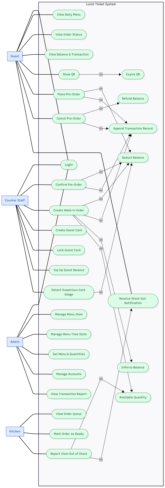

# Requirements & Analysis — Lunch Ticket System

This folder holds the requirements-analysis output for the project: the brainstormed problem statement, the use case diagram, and the INVEST-style user stories derived from it.

## Contents

| File | Description |
|---|---|
| `problem-statement.md` | Scope, pain points (priority order), and depth areas from the business brainstorm — source of truth for everything else in this folder |
| `usecase.md` | Use case diagram source (mermaid) and traceability table mapping each use case back to a pain point or depth area |
| `requirements.md` | One user story per use case, INVEST-checked, grouped by depth (financial ledger, depth-area use cases, QR pickup flow, everything else) |
| `Lunch_Ticket.png` | Use case diagram for this project (rendered) |
| `Components.png` | Component diagram |

## Use Case Diagram

See `usecase.md` for the mermaid source and the actor/use-case traceability table behind this diagram.

## Reading order

1. `problem-statement.md` — scope and pain points
2. `Lunch_Ticket.png` / `usecase.md` — use case diagram and traceability
3. `requirements.md` — user stories derived from the use cases, with open `[TBD]` business rules called out
