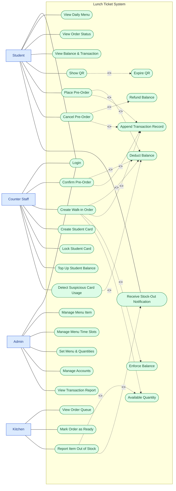

# Use Case Diagram — Lunch Ticket System

Source of truth: `docs/problem-statement.md`, expanded from an earlier detailed draft (actors, use cases, and include relationships), with the following corrections applied: a single system boundary (no per-actor or "System" boundaries), no "System" actor (include-only use cases have no direct actor arrow), consistent solid-outline ellipse shape for all use cases, spelling fixes, a single deduplicated "Login" use case, and the two missing depth-area use cases (stock-out reporting/notification, suspicious card usage detection).

## Diagram

Mermaid has no native UML actor (stick-figure) shape or boundary-box primitive, so this is approximated with a `subgraph` as the system boundary and `classDef` styling to distinguish actors (blue rectangles, outside the boundary) from use cases (green stadium/ellipse shapes, inside the boundary). The structure — one boundary, include/extend relationships, actor associations — is standard UML; only the rendering is a mermaid workaround, worth mentioning to the mentor if asked.

Use cases reachable only via `<<include>>` (Deduct Balance, Refund Balance, Append Transaction Record, Enforce Balance, Expire QR, Available Quantity) have no actor drawn to them directly — they are internal steps of the use cases that include them, not independently triggered.

## Traceability Table

| #    | Use Case                       | Actor(s)               | Maps to                                                                                                    |
| ---- | ------------------------------- | ----------------------- | ------------------------------------------------------------------------------------------------------------ |
| UC1  | Login                           | Student, Counter Staff, Admin | Core module — Identity & Auth                                                                          |
| UC2  | View Daily Menu                 | Student                 | Core module — Menu & Availability                                                                       |
| UC3  | View Order Status               | Student                 | Core flow — Order & Priority Queue; Pain Point 3 — processing speed                                     |
| UC4  | View Balance & Transaction      | Student                 | Core module — Transaction & Balance; Pain Point 1 — financial risk                                       |
| UC5  | Show QR                         | Student                 | Core flow — pickup confirmation; `<<include>>` Expire QR (UC27)                                          |
| UC6  | Place Pre-Order                 | Student                 | Core flow (Place Pre-order); Pain Point 2 — priority & fairness; includes Deduct Balance (UC23), Append Transaction Record (UC25) |
| UC7  | Cancel Pre-Order                | Student                 | Depth Area 1 — refund & cancellation limits; includes Refund Balance (UC24), Append Transaction Record (UC25) |
| UC8  | Confirm Pre-Order               | Counter Staff            | Core flow (Kitchen/counter pickup confirmation); includes Deduct Balance (UC23), Append Transaction Record (UC25) |
| UC9  | Create Walk-in Order            | Counter Staff            | Core flow (walk-in queue); Pain Point 3 — processing speed; includes Deduct Balance (UC23), Enforce Balance (UC26), Available Quantity (UC28), Append Transaction Record (UC25) |
| UC10 | Create Student Card             | Counter Staff            | Pain Point 1 — financial risk; lost/new card issuance                                                    |
| UC11 | Lock Student Card               | Counter Staff            | Pain Point 1 — financial risk; lost-card flow (lock old card)                                             |
| UC12 | Top Up Student Balance          | Counter Staff            | Core module — Transaction & Balance                                                                      |
| UC13 | Manage Menu Item                | Admin                    | Core module — Menu & Availability                                                                        |
| UC14 | Manage Menu Time Slots          | Admin                    | Core module — Menu & Availability                                                                        |
| UC15 | Set Menu & Quantities           | Admin                    | Core module — Menu & Availability                                                                        |
| UC16 | Manage Accounts                 | Admin                    | Core module — Identity & Auth (back-office)                                                               |
| UC17 | View Transaction Report         | Admin                    | Core module — Transaction & Balance (reporting)                                                            |
| UC18 | View Order Queue                | Kitchen                  | Core module — Kitchen Display; Pain Point 4 — kitchen operations                                          |
| UC19 | Mark Order as Ready             | Kitchen                  | Core module — Kitchen Display; Pain Point 3 — processing speed                                            |
| UC20 | Report Item Out of Stock        | Kitchen                  | Depth Area 2 — stock-out exception handling; includes Available Quantity (UC28), Receive Stock-Out Notification (UC21) |
| UC21 | Receive Stock-Out Notification  | Student                  | Depth Area 2 — stock-out exception handling; included by UC20, reuses existing SSE channel conceptually    |
| UC22 | Detect Suspicious Card Usage    | Counter Staff            | Depth Area 3 — fraud/fairness; `<<extend>>` of Deduct Balance (UC23), same card used in two places at once |
| UC23 | Deduct Balance                  | *(include-only, no direct actor)* | Pain Point 1 — financial risk; included by UC6, UC8, UC9; extended by UC22                     |
| UC24 | Refund Balance                  | *(include-only, no direct actor)* | Depth Area 1 — refund & cancellation limits; included by UC7                                    |
| UC25 | Append Transaction Record       | *(include-only, no direct actor)* | Pain Point 1 — financial risk (auditability); included by UC6, UC7, UC8, UC9                    |
| UC26 | Enforce Balance                 | *(include-only, no direct actor)* | Pain Point 1 — financial risk; included by UC9                                                  |
| UC27 | Expire QR                       | *(include-only, no direct actor)* | Core flow — pickup confirmation lifecycle; included by UC5                                      |
| UC28 | Available Quantity              | *(include-only, no direct actor)* | Pain Point 4 — kitchen operations / Depth Area 2 — stock-out handling; included by UC9, UC20    |

## Open item

Depth Area 2 leaves the stock-out resolution path (auto-substitute vs. auto-refund vs. staff-manual) as an undecided business rule in `problem-statement.md`. UC21 (Receive Stock-Out Notification) covers only the notification step; the resolution action itself is intentionally not modeled as a separate use case yet, pending that decision.
