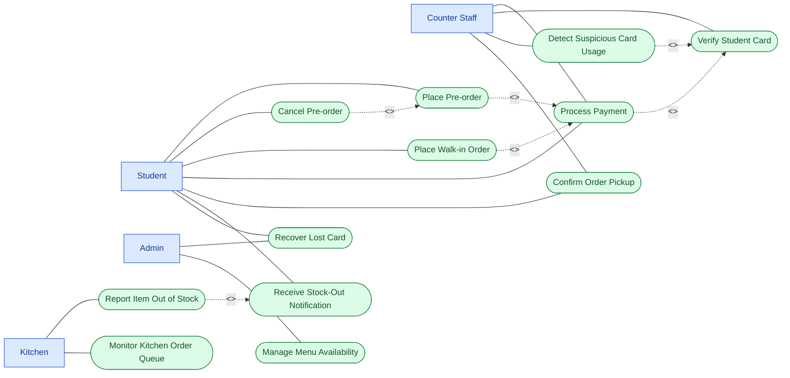

# Use Case Diagram — Lunch Ticket System

Source of truth: `docs/problem-statement.md`. This is a full redo from scratch per mentor feedback — no content is carried over from any prior use case diagram or document.

## Diagram

Mermaid has no native UML actor (stick-figure) shape, so actors and use cases are distinguished with `classDef` styling instead: actors are rectangular with one fill color, use cases keep their stadium/rounded shape with a different fill color. Worth flagging to the mentor if the rendering looks unlike a standard UML tool's output — the structure (actors, use cases, include/extend) is standard UML, only the node shapes/colors are a mermaid workaround.

## Traceability Table

| #    | Use Case                       | Actor(s)               | Maps to                                                                                                                 |
| ---- | ------------------------------ | ---------------------- | ----------------------------------------------------------------------------------------------------------------------- |
| UC1  | Place Pre-order                | Student                | Core flow (Place Pre-order); Pain Point 2 — priority & fairness                                                        |
| UC2  | Cancel Pre-order               | Student                | Depth Area 1 — refund & cancellation limits;`<<extend>>` of UC1                                                      |
| UC3  | Place Walk-in Order            | Student                | Core flow (walk-in queue, kept separate from pre-order queue per design principle)                                      |
| UC4  | Process Payment                | Student, Counter Staff | Core flow (Process Payment); Pain Point 1 — financial risk                                                             |
| UC5  | Verify Student Card            | Counter Staff          | Depth Area 3 — fraud/fairness;`<<include>>` of UC4 (payment always requires card verification)                       |
| UC6  | Detect Suspicious Card Usage   | Counter Staff          | Depth Area 3 — fraud/fairness;`<<extend>>` of UC5 (same card scanned in two places at once)                          |
| UC7  | Confirm Order Pickup           | Student, Counter Staff | Core flow (QR-based pickup confirmation); Pain Point 3 — processing speed                                              |
| UC8  | Report Item Out of Stock       | Kitchen                | Depth Area 2 — stock-out exception handling; Pain Point 4 — kitchen operations                                        |
| UC9  | Receive Stock-Out Notification | Student                | Depth Area 2 — stock-out exception handling;`<<include>>` of UC8, reuses existing SSE channel                        |
| UC10 | Monitor Kitchen Order Queue    | Kitchen                | Core flow (Kitchen order handling); Pain Point 3 & 4 — separate pre-order/walk-in queues, real-time demand visibility  |
| UC11 | Recover Lost Card              | Student, Admin         | Pain Point 1 — financial risk; non-negotiable lost-card flow (lock old card → issue new card → balance carries over) |
| UC12 | Manage Menu Availability       | Admin                  | Core module — Menu & Availability                                                                                      |

## Open item

Depth Area 2 leaves the stock-out resolution path (auto-substitute vs. auto-refund vs. staff-manual) as an undecided business rule in `problem-statement.md`. UC9 (Receive Stock-Out Notification) only covers the notification step; the resolution action itself is intentionally not modeled as a separate use case yet, pending that decision.
